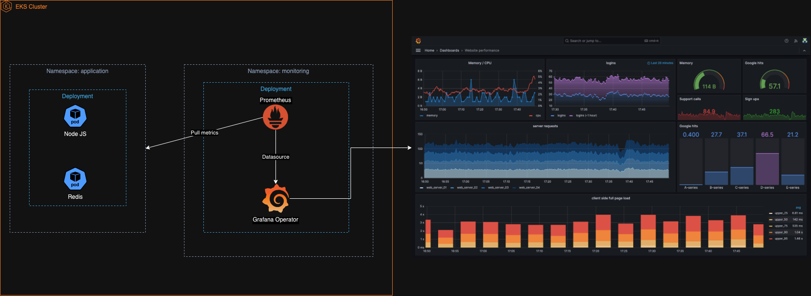

# Koronet - Technical Test

## Overview

This project is a technical test for creating a web server application using Node.js, Docker, Jenkins, and Kubernetes. The application is designed to be deployed on an AWS EKS cluster using Terraform for infrastructure provisioning.

## Project Structure
```bash
├── Dockerfile
├── Jenkinsfile
├── README.md
├── docker-compose.yml
├── k8s
│   ├── deployment.yaml
│   └── service.yaml
├── terraform
│   ├── main.tf
│   ├── outputs.tf
│   └── variables.tf
└── webserver
    ├── app.js
    ├── index.html
    └── package.json
```

### webserver/

This directory contains the Node.js application.

- `app.js`: The main application file for the Node.js web server.
- `package.json`: Contains the dependencies and scripts for the Node.js application.

### k8s/

This directory contains the Kubernetes deployment and service configurations.

- `deployment.yaml`: The Kubernetes deployment configuration file.
- `service.yaml`: The Kubernetes service configuration file.

### Jenkinsfile

The Jenkins pipeline configuration file that defines the CI/CD process, including building the Docker image, running tests, pushing the image to Docker Hub, and deploying to Kubernetes.

### terraform/

This directory contains the Terraform configuration files for provisioning an AWS EKS cluster.

- `main.tf`: The main Terraform configuration file that defines the AWS resources.
- `variables.tf`: Contains the variables used in the Terraform configuration.
- `outputs.tf`: Defines the outputs of the Terraform configuration.

## Prerequisites

- Terraform installed
- Docker installed
- kubectl installed
- AWS CLI configured with appropriate permissions
- Jenkins server (optional)

## Setup and Deployment

### Step 1: Build and Run the Web Server Locally

1. Run docker-compose in the root directory:
   ```sh
   docker-compose up -d
   ```

2. Navigate to http://localhost:3000/ in your local web browser
   - If you don't access to the root path or /index.html, it will return a 'Not Found' error 

### Step 2: Build and Push Docker Image

1. Build the Docker image by running the following command:
   ```sh
   docker build -t docker-repository/image-name .
   ```

2. Push the Docker image to Docker Hub or ECR by running the following command:
   ```sh
   docker push docker-repository/image-name
   ```

### Step 3: Provision AWS EKS Cluster with Terraform

1. Navigate to the terraform directory:
   ```sh
   cd terraform
   ```

2. Initialize Terraform:
   ```sh
   terraform init
   ```

3. Apply the Terraform configuration:
   ```sh
   terraform apply
   ```

### Step 4: Deploy to Kubernetes

1. Apply the Kubernetes deployment and service YAML files:
   ```
   kubectl apply -f k8s/deployment.yaml
   kubectl apply -f k8s/service.yaml
   ```

# Jenkins Pipeline
The Jenkins pipeline defined in the Jenkinsfile performs the following steps:

- Build the Docker image.
- Run tests inside the Docker container.
- Push the Docker image to Docker Hub.
- Deploy the application to the Kubernetes cluster.

# Monitoring high-level diagram
In case that we needed to implement a monitoring solution, we could deploy Grafana + Prometheus in an isolated namespace called "monitoring", then pull metrics from webserver and redis by using Prometheus and finally show these metrics in the Grafana Dashboard using Prometheus as the Datasource.



### Conclusion
This project demonstrates the integration of various tools and technologies to create a CI/CD pipeline for a Node.js web server application, deployed on an AWS EKS cluster using Terraform.